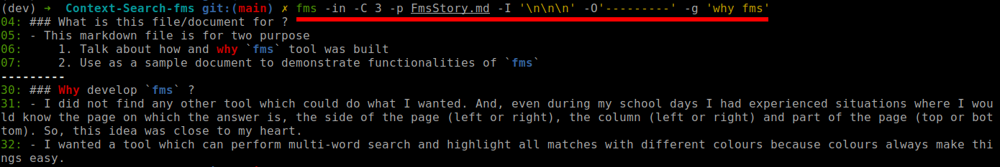

# Context-Search-fms
grep like utility to search text, PDF, docx, doc, odt, epub, rtf, dotx, docm,
fodt, ott and pptx files for context and highlight using different colors


### Why use `fms` ?

Has it ever happened that you know a few words of a line/paragraph but do not know in which document or in which page of the document you had read it ? If yes, then use `fms`. It will help you find the line/paragraph/document in a jiffy using Extended Regular Expression ([Regexp Syntax Summary](https://www.greenend.org.uk/rjk/tech/regexp.html))


### Installation Steps to use `fms`

```bash
# CONFIGURATIONS
# Create and enter the directory when "fms" and its
# dependencies will be downloaded and stored
INSTALL_DIR="${HOME}/bin"
# Modify this based on your shell
SHELL_INITIALIZATION="${HOME}/.bashrc"  # Use ".zshrc" for zsh

# Activate the right environment in virtualenv/conda
# conda activate base

mkdir "${INSTALL_DIR}"
cd "${INSTALL_DIR}"

# Install required tools               v required for `pdftotext`
sudo apt install unzip gawk grep sed poppler-utils catdoc
# https://github.com/alttch/neotermcolor/
pip install neotermcolor
# https://github.com/mbornet-hl/hl
wget https://github.com/mbornet-hl/hl/raw/master/hl
chmod +x hl

# Download fms
wget https://github.com/fenilgmehta/Context-Search-fms/raw/main/fms.py
chmod +x fms.py

# Add ${PATH} to shell initialization files
PATH="${PATH}:$(pwd)"
echo "PATH=\"\${PATH}:$(pwd)\"" >> ${SHELL_INITIALIZATION}
alias fms="python3 ${INSTALL_DIR}/fms.py"
echo "alias fms=\"python3 ${INSTALL_DIR}/fms.py\"" >> ${SHELL_INITIALIZATION}

# Enjoy :)
fms --help
```


### Example
- `fms -in -C 3 -p FmsStory.md -I '\n\n\n' -O'---------' -g 'why fms'`
  
- `fms -in -C 3 -p FmsStory.md -I '\n\n\n' -O'---------' -w 'multi(-)?word' -w 'search'`
  
- Other examples of simple highlighting
  ```sh
  ps -e | fms -C 100000 -W '((0[1-9]|[1-9][0-9])(:[0-9]{2}){2} .*)' -W '(00:00:[1-9][0-9] .*)' -W '(00:(0[1-9]|[1-9][0-9]):[0-9]{2} .*)'
  ip a | fms -C100000 -W '\<((([0-9]|[1-9][0-9]|1[0-9][0-9]|2[0-4][0-9]|25[0-5])\.){3}([0-9]|[1-9][0-9]|1[0-9][0-9]|2[0-4][0-9]|25[0-5]))\>' -W '(^[0-9]+: )(\d|\w+)'
  ifconfig | fms -C 1000 -W '([a-z]+[0-9]*)+: ' -W '([0-9a-f]{2}:){5}[0-9a-f]{2}' -W '\<UP\>|\<RUNNING\>|([0-9]{1,3}\.){3}[0-9]{1,3}\>' -W '^(eth|(vir)?br|vnet)[0-9.:]*\>' -W '[0-9a-f]{4}::[0-9a-f]{4}\:[0-9a-f]{4}:[0-9a-f]{4}:[0-9a-f]{4}' -W '(errors|dropped|overruns):[^0][0-9]*'
  echo "abcdefghijklmnopqrstuvwxyz" | fms -g "a b c d e f g h i j k l n o p q r s t u v w x y z"
  ```


### Usage

```bash
# Print the version of FMS you are using
fms.py --version

# Print help
fms.py --help

```

```
usage: fms.py [-h] [--version]
              [-p PATH [PATH ...]] [-r [RECURSIVE [RECURSIVE ...]]]
              [-X [EXTEXCLUDE [EXTEXCLUDE ...]]] [-x EXTENSIONS [EXTENSIONS ...]]
              [-i] [-l] [-C --context]
              [-g --group] [-g2 --group2] [-w --word [--word ...]] [-W --Word [--Word ...]]
              [--color COLOR] [-n] [-v] [-Q]
              [-I INPUT_RECORD_SEPARATOR] [-O OUTPUT_SEGMENT_SEPARATOR]
              [--cmd CMD]
              [-D]

Smart multi-word context search across multiples lines

optional arguments:
  -h, --help            show this help message and exit
  --version             show program's version number and exit
  -p PATH [PATH ...], --path PATH [PATH ...]
                        The path to the text file to search (supports glob)
  -r [RECURSIVE [RECURSIVE ...]], --recursive [RECURSIVE [RECURSIVE ...]]
                        The list of paths to be used for recursive search [default: .]
  -X [EXTEXCLUDE [EXTEXCLUDE ...]], --extexclude [EXTEXCLUDE [EXTEXCLUDE ...]]
                        Files with these extensions to be excluded from being searched for
                        -r flag (Example Usage: -X tex -X gz OR -x "tex gz") (Note: for
                        "file.tar.gz" only "-X gz" should be used) (Note: -X gets priority
                        over -x) (Default exlude list will be used if not parameters are
                        passed, or "defaults" is passed as a parameter: jpeg jpg png zip tar
                        gz exe mp4 mkv ctb ctb~ ctb~~ ctb~~~)
  -x EXTENSIONS [EXTENSIONS ...], --extensions EXTENSIONS [EXTENSIONS ...]
                        Files with these extensions only to be searched for -r flag (Example
                        Usage: -x md -x pdf OR -x "md pdf") (Note: for "file.tar.gz" only
                        "-x gz" should be used)
  -i, --ignore-case     Ignore case while searching
  -l, --files-with-matches
                        Supress normal output and just print the file names which satisfy
                        the search query
  -C --context          Number of lines in the context [default: 10]
  -g --group            Any ONE white space separated group of words to search (this gets
                        priority over -w parameter)
  -g2 --group2          Any TWO white space separated group of words to search (this gets
                        priority over -w parameter)
  -w --word [--word ...]
                        Word to search
  -W --Word [--Word ...]
                        Optional words to search
  --color COLOR         Can either be auto, always or never [default: auto]
  -n, --line-number     Print line number (Note: printing line numbers may cause problem -I
                        parameter and REGEX which use "^")
  -v, --verbose         Print expression highlighted and number of segments which satisfied
                        the search conditions (Bug: content printed because of this flag
                        will be colored for --color=auto even if the output is not directed
                        to a TTY)
  -Q                    Do not print anything for files in which no results found
  -I INPUT_RECORD_SEPARATOR, --input-record-separator INPUT_RECORD_SEPARATOR
                        String to separate the input based on the record separator. This
                        input will be evaluated as python string. So, to use newline
                        followed by two hyphen, just write "\n--". Note: input will be
                        evaluated using python syntax. Hence, no need to make bash correctly
                        interpret special characters such as "\n" or "\t"
  -O OUTPUT_SEGMENT_SEPARATOR, --output-segment-separator OUTPUT_SEGMENT_SEPARATOR
                        String to separate the output segments which matched the pattern
                        [default: --]
  --cmd CMD             Command to use to read the input file and to write the output to
                        stdout. Insert {} in the command WITHOUT quotes to insert file name,
                        e.g. "pdftotext {} -"
  -D, --debug           Print debug information

Enjoy the program :)
```

